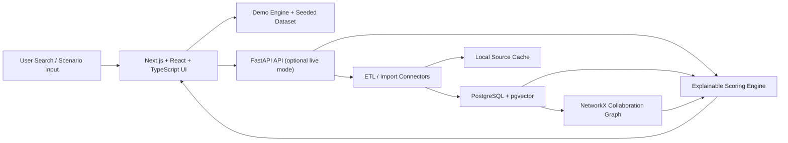

# EU Funding Signal

EU Funding Signal is an explainable decision-support web app for public funding managers. A user enters a signal such as `interposer`, `advanced packaging`, `battery passport`, or `circular construction`, and the app ranks current EU funding opportunities, proposes likely coordinators, suggests consortium and country patterns, compares candidate coordinators, and generates evidence-backed next steps.

The product is intentionally honest. It does not claim to compute a true causal chance of winning. When an official public baseline success rate exists, it produces a `Public-data probability estimate` band anchored to that baseline. When no public baseline exists, it produces a `Relative win-likelihood index` from 0 to 100.

## What It Does

- Ranks current open topics and calls using hybrid lexical plus semantic retrieval.
- Surfaces public-data probability bands when programme dashboard baselines are available.
- Falls back to a relative win-likelihood index when no official baseline exists.
- Recommends exemplar coordinator organisations and coordinator countries.
- Suggests consortium country mix and partner role mix.
- Simulates which supplied partner should coordinate.
- Explains every score with raw factors, analogue projects, coordinator evidence, and source links.
- Runs immediately in demo mode with seeded sample data.

## What It Does Not Do

- It does not ingest rejected proposals, evaluator comments, CRM history, or private proposal archives.
- It does not claim a true win/loss classifier or guaranteed success probability.
- It does not use country as a dominant explanation.
- It does not rely on login-required scraping.

## Truthfulness Limits

This estimate is based on public funded-project data, public programme statistics, and historical consortium patterns. It does not include rejected proposals or private evaluator feedback. Treat this as decision support, not a guaranteed chance of success.

## Architecture



## Repo Structure

```text
eu-funding-signal/
├── README.md
├── .env.example
├── firebase.json
├── docker-compose.yml
├── scripts/
│   └── deploy-firebase.mjs
├── data/
│   └── sample/
│       ├── candidate_partners.csv
│       ├── topics_manual.csv
│       ├── programme_stats_manual.csv
│       ├── cordis_manual.json
│       └── fts_manual.csv
├── frontend/
│   ├── app/
│   ├── components/
│   ├── lib/
│   │   ├── demo-dataset.json
│   │   ├── engine.ts
│   │   ├── api.ts
│   │   └── types.ts
│   └── package.json
└── backend/
    ├── pyproject.toml
    ├── alembic/
    ├── tests/
    └── src/eu_funding_signal/
        ├── main.py
        ├── cli.py
        ├── connectors/
        ├── db/
        └── services/
```

## Quick Start

### Demo mode

1. Install frontend dependencies:

   ```bash
   cd frontend
   npm install
   ```

2. Start the static/demo web app in development:

   ```bash
   npm run dev
   ```

3. Open `http://localhost:3000`.

The demo mode is self-contained and uses seeded data from [frontend/lib/demo-dataset.json](/Users/seyedschwanhosseiny/Documents/Playground/eu-funding-signal/frontend/lib/demo-dataset.json).

### Backend API mode

1. Create a virtual environment and install the backend:

   ```bash
   cd backend
   python3 -m venv .venv
   . .venv/bin/activate
   python -m pip install -e '.[dev]'
   ```

2. Run the FastAPI server:

   ```bash
   uvicorn eu_funding_signal.main:app --reload --host 0.0.0.0 --port 8000
   ```

3. Switch the frontend to API mode with:

   ```bash
   export NEXT_PUBLIC_APP_MODE=backend
   export NEXT_PUBLIC_API_BASE_URL=http://localhost:8000
   ```

### Docker

Docker configuration is included in [docker-compose.yml](/Users/seyedschwanhosseiny/Documents/Playground/eu-funding-signal/docker-compose.yml) and the service Dockerfiles. Docker was not available in this environment, so the compose stack is provided but was not validated in-session.

## Demo Queries

- `interposer`
- `advanced packaging`
- `battery passport`
- `circular construction`
- `hydrogen storage`

## Data Source Notes

- Funding & Tenders Portal: public portal landing page support plus manual upload fallback.
- Programme Dashboards: public landing page snapshot plus manual upload fallback.
- CORDIS Open Data: public Datalab landing page snapshot plus manual upload fallback.
- Financial Transparency System: public landing page snapshot plus manual upload fallback.
- Optional partner search and participant register connectors are intentionally disabled by default.

The connector implementations live under [backend/src/eu_funding_signal/connectors](/Users/seyedschwanhosseiny/Documents/Playground/eu-funding-signal/backend/src/eu_funding_signal/connectors).

## Manual Upload Mode

Sample files are included under [data/sample](/Users/seyedschwanhosseiny/Documents/Playground/eu-funding-signal/data/sample):

- [candidate_partners.csv](/Users/seyedschwanhosseiny/Documents/Playground/eu-funding-signal/data/sample/candidate_partners.csv)
- [topics_manual.csv](/Users/seyedschwanhosseiny/Documents/Playground/eu-funding-signal/data/sample/topics_manual.csv)
- [programme_stats_manual.csv](/Users/seyedschwanhosseiny/Documents/Playground/eu-funding-signal/data/sample/programme_stats_manual.csv)
- [cordis_manual.json](/Users/seyedschwanhosseiny/Documents/Playground/eu-funding-signal/data/sample/cordis_manual.json)
- [fts_manual.csv](/Users/seyedschwanhosseiny/Documents/Playground/eu-funding-signal/data/sample/fts_manual.csv)

Use them with the CLI commands below or with the upload UI in the admin page.

## ETL / Import Commands

All CLI commands are exposed through `eu-funding-signal` after installing the backend package.

```bash
cd backend
. .venv/bin/activate
eu-funding-signal import-topics --manual-file ../data/sample/topics_manual.csv
eu-funding-signal import-programme-stats --manual-file ../data/sample/programme_stats_manual.csv
eu-funding-signal import-cordis --manual-file ../data/sample/cordis_manual.json
eu-funding-signal import-fts --manual-file ../data/sample/fts_manual.csv
eu-funding-signal build-embeddings
eu-funding-signal build-graph
eu-funding-signal refresh-all
```

Connector runs cache their outputs under the backend cache directory. Imports are designed to be idempotent and to isolate failures per connector.

## Probability Bands

When an official public baseline success rate exists:

1. The relevant programme/action baseline is loaded from public dashboard statistics.
2. Topic, coordinator, consortium, and coverage scores shift the baseline through bounded Monte Carlo adjustment.
3. The app returns `p10`, `median`, and `p90` rather than a fake single-point estimate.
4. Outputs are clamped to avoid implausible certainty.

When no public baseline exists:

- The app shows `Relative win-likelihood index`.
- The index is based on public analogues, coordinator history, consortium fit, and coverage quality.

## Confidence Levels

- `High`: strong analogue density, baseline available, and low missingness.
- `Medium`: useful analogue density but partial missingness or weaker baseline alignment.
- `Low`: sparse analogues and/or no public baseline anchor.

## Validation

This repo includes an honest validation script:

```bash
cd backend
. .venv/bin/activate
eu-funding-signal validate --split-year 2024 --k 3
```

The validation reports:

- `hit@k`
- `ndcg@k`
- coordinator recommendation hit rate

It explicitly does **not** claim proposal win/loss accuracy.

## Simulating Candidate Coordinators

1. Add candidate partners on the search page or import them from CSV.
2. Open the scenario compare view.
3. The app fuzzy-matches candidate names to public canonical organisations.
4. It ranks coordinator options, shows the delta versus the best candidate, and highlights missing roles.

## Adding New Connectors

1. Add a new connector module under [backend/src/eu_funding_signal/connectors](/Users/seyedschwanhosseiny/Documents/Playground/eu-funding-signal/backend/src/eu_funding_signal/connectors).
2. Return a `ConnectorFetchResult`.
3. Register the connector in [backend/src/eu_funding_signal/cli.py](/Users/seyedschwanhosseiny/Documents/Playground/eu-funding-signal/backend/src/eu_funding_signal/cli.py).
4. Expose any UI controls from the admin page if needed.

## Firebase Deployment

This repo includes a zero-touch static demo deployment path for Firebase Hosting:

```bash
FIREBASE_PROJECT_ID=your-project-id node scripts/deploy-firebase.mjs
```

The script installs the frontend, builds the static export, and deploys `frontend/out` via [firebase.json](/Users/seyedschwanhosseiny/Documents/Playground/eu-funding-signal/firebase.json).

## Key Files

- Frontend scoring and demo retrieval: [frontend/lib/engine.ts](/Users/seyedschwanhosseiny/Documents/Playground/eu-funding-signal/frontend/lib/engine.ts)
- FastAPI service entrypoint: [backend/src/eu_funding_signal/main.py](/Users/seyedschwanhosseiny/Documents/Playground/eu-funding-signal/backend/src/eu_funding_signal/main.py)
- Backend scoring engine: [backend/src/eu_funding_signal/services/engine.py](/Users/seyedschwanhosseiny/Documents/Playground/eu-funding-signal/backend/src/eu_funding_signal/services/engine.py)
- Initial migration: [backend/alembic/versions/20260404_0001_initial_schema.py](/Users/seyedschwanhosseiny/Documents/Playground/eu-funding-signal/backend/alembic/versions/20260404_0001_initial_schema.py)
- Firebase deploy script: [scripts/deploy-firebase.mjs](/Users/seyedschwanhosseiny/Documents/Playground/eu-funding-signal/scripts/deploy-firebase.mjs)
- Full-stack deploy script: [scripts/deploy-full-stack.mjs](/Users/seyedschwanhosseiny/Documents/Playground/eu-funding-signal/scripts/deploy-full-stack.mjs)
- Production deployment notes: [docs/PRODUCTION_DEPLOYMENT.md](/Users/seyedschwanhosseiny/Documents/Playground/eu-funding-signal/docs/PRODUCTION_DEPLOYMENT.md)
